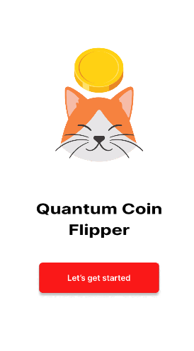
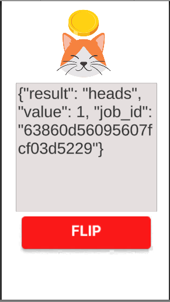

## What is Quantum Coin Flipper App?

A simple game which uses IBM Quantum Computer. It applies a single hadamard gate into the first qubit and then measure it to arrive into a classical state of 0 or 1. Currently, it uses Unity Framework as our frontend (C#) and Django as our backend (Python). We use Django since Qiskit is a Python Library.

Unfortunately heroku doesn't provide any free service now. We can deploy via localhost.

## Branches

`main` - localhost

## Demo:




## Video Demo (download as raw to watch, GH can't display):


## Requirements:

- Install django via pip

```
pip install django==3.1.5 --user
pip install qiskit --user
```

- I use python version 3.8

## API Reference

`localhost:8000/` - home page, this will redirect you to OneQuantum Philippines Youtube channel, please consider subscribing :blush:

`localhost:8000/backends` - fetches all available backend under ibm_q provider using your supplied API Key

`localhost:8000/backends/least` - fetches the least busy backend, except the simulators: `ex. ibmq_qasm_simulator`

`localhost:8000/results` - executes a job on ibm quantum computers and the return the result of the job execution

## Limitations

- **Backend can't handle concurrent connections.** Meaning that the result might get disrupted once another user is trying to connect using the same backend.
- **Backend persist state such as IBM Quantum API Key.** It's important to re-generate your API Key for security purpose. You can also run your code in localhost for added security.

## Future Improvements

- (Optional) Migrate the Frontend to JavaScript. Currently we are using Unity Framework for our Frontend.
- Refactoring the Code to be efficient.
